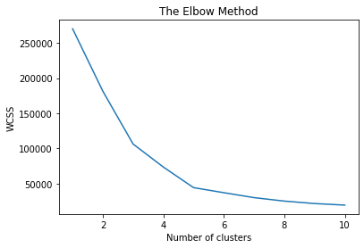
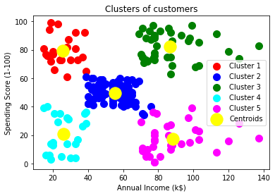

# 🎯 Customer Segmentation using K-Means Clustering

*Intelligent customer segmentation using unsupervised machine learning to drive business insights*

---

## 📋 Overview

Understanding customer behavior is essential for improving marketing strategies, customer engagement, and overall business performance. 

This project implements **K-Means clustering**, an unsupervised machine learning algorithm, to analyze mall customer data and identify distinct customer segments based on annual income and spending patterns.

The objective is to provide **data-driven insights** that support decision-making and help businesses better understand different customer categories.

---

## 💼 Business Problem

Businesses often struggle to identify which customers contribute the most value and how different customer groups behave. Without proper customer segmentation, marketing campaigns and business strategies may lack precision.

### Key Questions This Project Answers:
- ❓ Which customers generate high spending activity?
- ❓ Which high-income customers spend less than expected?
- ❓ Which customer groups require targeted marketing strategies?
- ❓ How can customer behavior improve business decisions?

---

## 🎯 Business Objectives

**Primary Goal:** Group customers into meaningful segments based on purchasing behavior and financial characteristics.

### 📈 Business Impact:
- ✅ Improve targeted marketing campaigns
- ✅ Increase customer retention rates
- ✅ Identify high-value customers
- ✅ Understand customer purchasing trends
- ✅ Support strategic decision-making

---

## 📊 Dataset Information

The dataset contains comprehensive mall customer information with the following variables:

| Feature | Description |
|---------|-------------|
| Customer ID | Unique identifier for each customer |
| Gender | Customer gender |
| Age | Customer age |
| Annual Income (k$) | Annual income in thousands |
| Spending Score (1–100) | Spending behavior score |

**Selected Features for Segmentation:**
- 💰 Annual Income
- 🛍️ Spending Score

---

## 🔬 Methodology

### 1️⃣ Data Preparation
- Imported customer data
- Selected relevant business variables
- Checked for missing values and inconsistencies
- Prepared data for analysis

### 2️⃣ Exploratory Data Analysis (EDA)
Explored the data to understand customer characteristics and relationships between variables.

### 3️⃣ Determining Optimal Number of Clusters

**Elbow Method Analysis**

*The elbow method helps identify the optimal number of clusters by analyzing the within-cluster sum of squares (WCSS) at different cluster levels.*

### 4️⃣ Customer Segmentation

**K-Means Clustering Results**

*Five distinct customer segments identified based on income and spending patterns.*

### 5️⃣ Visualization & Insights

Visualized customer clusters to interpret customer behavior and derive actionable business implications.

---

## 🔍 Key Findings

Based on the elbow method analysis, **5 customer segments** were identified:

### 💎 **Segment 1: High Income — High Spending**
Premium customers representing high-value consumers. 
- **Strategy:** Target for premium products and loyalty programs

### 💼 **Segment 2: High Income — Low Spending**
Customers with significant purchasing potential not yet fully engaged.
- **Strategy:** Benefit from personalized promotions and exclusive offers

### 🌟 **Segment 3: Low Income — High Spending**
Engaged customers demonstrating strong purchasing behavior despite lower income.
- **Strategy:** Focus on value offerings and build long-term relationships

### 📍 **Segment 4: Low Income — Low Spending**
Cost-sensitive customer base with limited current engagement.
- **Strategy:** Require cost-sensitive marketing approaches

### 📊 **Segment 5: Moderate Income — Moderate Spending**
General customer population with average purchasing behavior.
- **Strategy:** Standard marketing approaches with seasonal campaigns

---

## 💻 Technologies Used

| Technology | Purpose |
|-----------|---------|
| **Python** | Programming language |
| **Pandas** | Data manipulation & analysis |
| **NumPy** | Numerical computing |
| **Matplotlib** | Data visualization |
| **Scikit-Learn** | Machine learning algorithms |
| **Jupyter Notebook** | Interactive development |

---

## 🚀 Future Improvements

- [ ] Include additional customer variables for richer segmentation
- [ ] Compare K-Means with other clustering techniques (DBSCAN, Hierarchical)
- [ ] Build an interactive dashboard for real-time insights
- [ ] Implement RFM (Recency, Frequency, Monetary) analysis
- [ ] Create customer lifetime value predictions

---

## 👨‍💻 Author

**Neo Mohlomi**  
*MSc Astrophysics | Data Science | Machine Learning*

---

## 📝 License

This project is open source and available for educational and commercial use.

---

**⭐ If you found this project helpful, please consider giving it a star!**

